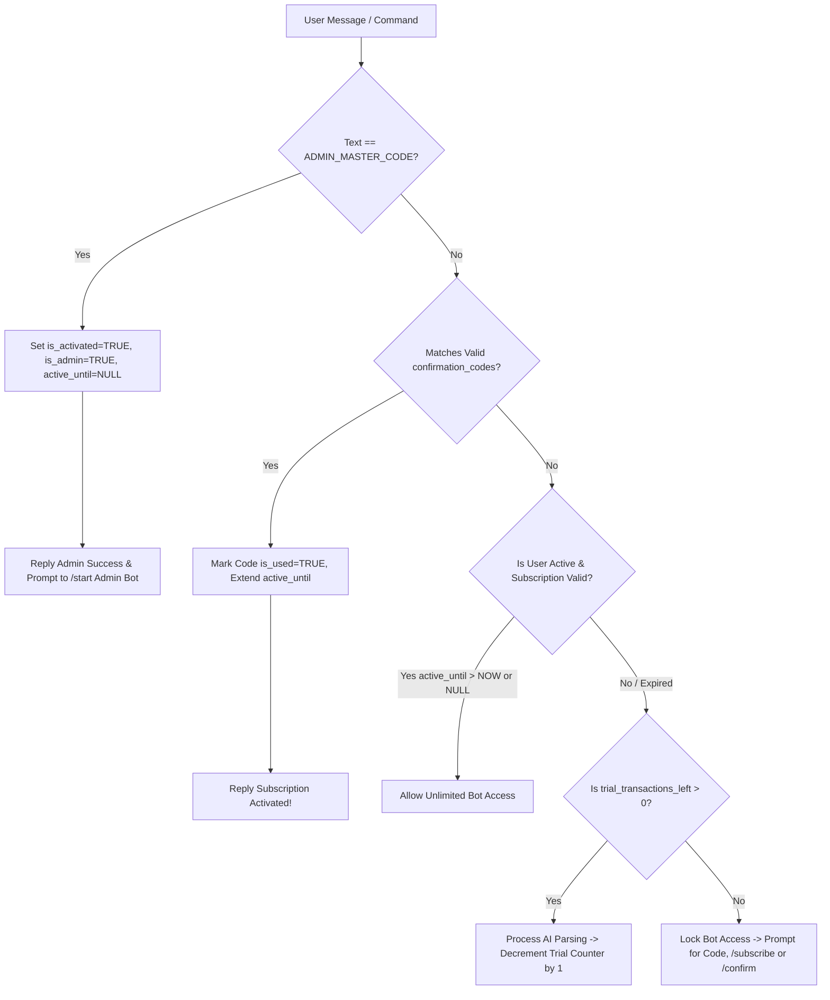
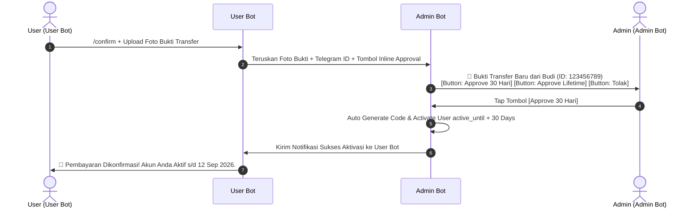

# Module 3: Authentication, Free Trial & Subscription System

## 1. Free Trial & Access Control Workflow

### 1.1 Automatic New User Registration
Ketika pengguna pertama kali mengirimkan pesan / command `/start`:
- Bot mendaftarkan `telegram_id` pengguna di tabel `users` dengan status:
  - `trial_transactions_left = 5`
  - `is_activated = FALSE`
  - `active_until = NULL`

---

## 2. Access Control Middleware Logic

---

## 3. Payment Confirmation & One-Tap Admin Approval Workflow (`/confirm` & Interactive Buttons)

### 3.1 Alur Konfirmasi Pembayaran (`/confirm`):
1. **User Upload Bukti Transfer (`/confirm`)**:
   - Pengguna mengirimkan foto struk transfer / QRIS dengan command `/confirm` (atau langsung mengunggah foto saat status trial mepet/expired).
   - User Bot meneruskan foto bukti transfer tersebut ke chat room **Admin Bot**.
2. **One-Tap Approval Inline Buttons di Admin Bot**:
   - Admin Bot menampilkan foto bukti transfer disertai **Inline Keyboard Buttons**:
     - `[✅ Approve 30 Hari]` (callback_data: `approve_sub:123456789:30`)
     - `[✅ Approve 365 Hari]` (callback_data: `approve_sub:123456789:365`)
     - `[✅ Approve Lifetime]` (callback_data: `approve_sub:123456789:0`)
     - `[❌ Tolak]` (callback_data: `reject_sub:123456789`)
3. **Eksekusi 1-Tap Admin**:
   - Ketika Admin menekan salah satu tombol `Approve`, sistem secara otomatis:
     1. Meregenerasi Kode Konfirmasi.
     2. Mengubah `is_activated = TRUE` dan memperpanjang `active_until` pengguna.
     3. Mengirimkan notifikasi sukses perpanjangan langsung ke chat room **User Bot** pengguna!
